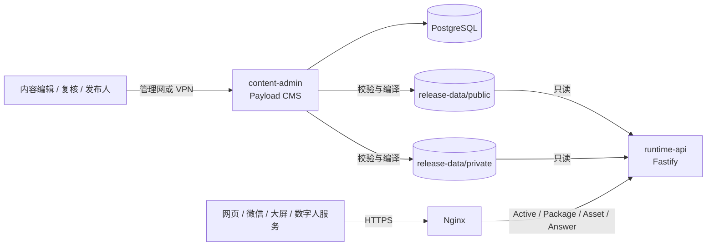

# “大未来”数字人内容中台 MVP 实施方案

> 目标：先跑通后台内容供给闭环，再逐步增强智能化与实时能力

- **版本：** V1.0
- **日期：** 2026年9月3日
- **范围：** 内容中台、发布运行时及前台取数契约
- **不包含：** 微信/网页/大屏界面设计、数字人形象与渲染、TTS/口型实现
- **上位方案：** [《大未来数字人内容中台技术方案 V1.0》](./大未来数字人内容中台技术方案_V1.0.md)

## 1. MVP 结论

首版不建设“大而全”的内容平台，只跑通一条可上线演练、可持续迭代的闭环：

> 权威来源登记 → 内容录入 → 提交复核 → 审批 → 发布校验 → 生成不可变发布包 → 前台统一取数 → 可追溯问答 → 整包回滚。

MVP 必须证明三件事：

1. 对外内容来自明确来源，且经过不同人员复核。
2. 所有已启用 Target 消费同一个 Release 的完整目标包，不直接读取后台草稿。
3. 错误发布可以在 60 秒内切回上一完整版本，前台不会混用新旧内容。

### 1.1 推荐落地形态

采用单仓库、单机 Docker Compose、少量服务的方式部署：

- **内容管理：** Payload CMS 3.x 稳定版，使用其现成管理后台、版本/草稿与访问控制能力。
- **中台开发语言：** TypeScript，运行于 Node.js 24 LTS。
- **内容数据库：** PostgreSQL。
- **运行时接口：** Fastify，仅读取已发布包，不读取 CMS 草稿。
- **内容分发：** Nginx 反向代理和缓存。
- **文件存储：** 首版使用主机持久卷；已有 S3/MinIO 时直接复用，但不为新建对象存储拖延 MVP。
- **更新机制：** 前台每 10 秒轮询活动版本并使用 ETag；首版不建设 SSE/WebSocket。
- **问答机制：** 结构化事实 + 已审核 FAQ + 人工别名匹配；无依据即拒答，首版不使用开放式 RAG。

这不是最终高可用架构。它是可从一台服务器启动、又不会破坏后续演进边界的生产演练版。

### 1.2 两个完成口径

必须把“系统跑起来”和“内容可以正式发布”分开验收：

| 口径 | 完成条件 |
| --- | --- |
| 系统 MVP 已完成 | 测试数据下，采编审发、取包、问答、回滚、备份恢复全部通过 |
| 生产内容可上线 | 日期、地点、来源、联系人等业务阻断项关闭，首发 Release 经业务签署并完成真实前台联调 |

即使业务事实仍待确认，系统也可先用脱敏测试数据部署；但不得把待定事实带入生产包。

## 2. 范围冻结

### 2.1 Must：首版必须完成

| 能力 | MVP 实现 | 验收结果 |
| --- | --- | --- |
| 来源登记 | 文件名、版本、发布日期、权威级别、责任人、有效期、SHA-256 | 任一生产内容能反查有效来源 |
| 内容类型 | 事实、议程、FAQ、通知、数字人口播稿、资产 | 覆盖首发静态内容和标准问答 |
| 修订与审核 | 草稿、送审、批准、撤回；保留每次修订 | 未批准修订无法进入发布包 |
| 四眼原则 | P0 事实的修订作者与批准人不得相同 | 自审请求被服务端拒绝 |
| 发布阻断 | 来源、占位符、冲突、有效期、断链、敏感字段、目标范围、客户端兼容性 | 任一严重错误均阻断发布，原线上版本不变 |
| 不可变发布 | 每次构建生成新的 ReleasePackage 和哈希 | 已发布包不被覆盖或原地修改 |
| 原子激活 | 通过一个活动指针一次切换全部目标包 | 不出现跨版本混用 |
| 整包回滚 | 重新激活上一组完整包并递增激活序号 | 60 秒内恢复，过程可审计 |
| 前台交付 | Active、Package、Asset、Answer 接口 | 前台不访问 CMS、数据库或草稿 |
| 确定性问答 | 当前 Package 内的事实和审核 FAQ；无依据拒答 | 答案带来源、内容修订和 Release ID |
| 离线供给 | 中台提供完整包、资产清单、哈希和 `fallbackPackageId` | 参考客户端能校验、缓存并切回最后成功包 |
| 最小运维 | 健康检查、日志、备份、恢复、部署和回滚手册 | 清洁环境可按手册重建服务 |

### 2.2 Should：有余量再做

- 发布前的可视化差异预览；首版至少保留机器可读差异。
- 定时激活和自动失效；首版可以人工激活。
- CSV/Excel 批量导入；首版允许后台表单录入和脚本导入。
- 简单 Webhook；首版由前台轮询活动版本。
- 客户端成功/失败回执；首版先用参考客户端日志和 k6 验证收敛。
- 大屏离线 ZIP 自动导出；首版允许按 Release 手工导出。
- FAQ 模糊匹配增强；首版使用标准问法、人工别名和关键词。
- 预发布独立域名；首版至少使用独立配置和测试 Target。

### 2.3 Won't：明确后置

- 开放式大模型问答、向量数据库和复杂 RAG。
- 实时录音转写、讨论自动捕捉、发言提纲和成果图谱。
- TTS、字幕、口型、动作和 2D/3D 数字人任务编排。
- SSE/WebSocket、Live Cue 实时控制和复杂灰度分组。
- 自研内容管理界面、可视化场景编排器。
- 个性化推荐、用户画像、多租户和泛化数据中台。
- Redis、RabbitMQ/Kafka、Kubernetes、多地域容灾。
- 1020 路同时大模型生成；MVP 只验证内容读取和版本收敛。

RenderSpec 首版只冻结 `plain-text.v1` 与 `notice-list.v1` 两种仓库内组件，并要求前台实现前者兜底；不建设组件注册中心、条件布局或通用场景编排。

## 3. 最小运行架构



### 3.1 Compose 服务

| 服务 | 职责 | 公网暴露 |
| --- | --- | --- |
| `postgres` | 来源、内容修订、审批、Release、激活和审计 | 否 |
| `content-admin` | 现成采编后台、权限、审核、校验和发布编译 | 否；仅管理网/VPN |
| `runtime-api` | 活动指针、授权取包、确定性问答；可选接收客户端回执 | 仅经 Nginx |
| `nginx` | HTTPS、路由、限流、公开响应缓存；不挂载发布目录 | 是，443 |
| `migrate` | 一次性执行数据库迁移 | 否 |
| `seed` | 一次性创建角色、Target 和脱敏样例 | 否 |
| `backup` | 数据库和发布目录备份脚本，由宿主机定时器调用 | 否 |

所有镜像和依赖必须锁定已测试的精确版本或镜像摘要，禁止生产使用 `latest`。

### 3.2 单机基线

首轮可从 **4 vCPU、8 GB 内存、100 GB SSD** 的 Linux 主机起步，另配独立备份空间。该基线不包含模型推理、TTS 和数字人渲染，也不是容量保证；是否满足上线要求，以本方案的 1020 客户端收敛测试和 300 RPS 静态读取压测为准。

Compose 单机不等于高可用。MVP 的故障策略是：管理面停机不影响已经发布的内容；运行时异常时前台继续使用最后成功包；主机故障依靠备份恢复，而不是宣称自动容灾。

`runtime-api` 的就绪检查只依赖有效 `active.json`、对应 Package 和只读发布目录，不依赖 PostgreSQL；`content-admin` 的就绪检查才依赖数据库。这样数据库维护不会误判为已发布静态内容不可用。

### 3.3 选择 Payload 而非临时自研后台

Payload 可自托管，提供版本/草稿、基于角色和字段的访问控制、PostgreSQL 适配器以及 Docker 部署路径，适合把首版研发集中在审核规则、发布编译和交付契约上。MVP 使用稳定主版本并锁定精确依赖，不追逐新版本。

Payload 的 Local API 默认可绕过访问控制。发布、审批等自定义服务端操作必须显式传入当前用户并设置 `overrideAccess: false`，或者在调用前执行等价的服务端授权；不能因为操作发生在后台代码中就默认可信。

原完整版中提到的 Directus 仍可作为替代方案，但其当前许可证和功能分层必须由采购/法务确认，尤其不能在临上线时才发现自定义权限或 SSO 需要额外许可。因此本 MVP 默认采用 MIT 许可的 Payload，避免许可证成为关键路径阻断项。

这是无既有技术栈信息时的默认选择。如果现有 Java/CMS 工程已能在半天内提供表单、版本和角色能力，应优先复用现有基础；但 ReleasePackage、校验器、Active、回滚和 Delivery 契约不得因此改变。9 月 4 日前仍无法在目标主机启动管理端时，立即切回现有技术栈，不继续消耗上线窗口做框架试验。

这是无既有技术栈信息时的默认选择。如果现有 Java/CMS 工程已能在半天内提供表单、版本和角色能力，应优先复用现有基础；但 ReleasePackage、校验器、Active、回滚和 Delivery 契约不得因此改变。9 月 4 日前仍无法在目标主机启动管理端时，立即切回现有技术栈，不继续消耗上线窗口做框架试验。

## 4. 最小内容模型

### 4.1 管理对象

| 集合 | 作用 | 核心字段 |
| --- | --- | --- |
| `source_documents` | 权威来源登记 | `sourceId`、标题、版本、权威级别、责任人、有效期、文件哈希 |
| `facts` | 日期、地点、人数、规则、联系人等确定性事实 | `factKey`、值类型、值、单位、适用范围、来源 |
| `agenda_items` | 报到、课程、会议和参访议程 | 开始/结束时间、地点引用、标题、班型、来源 |
| `faqs` | 标准问答 | 标准问题、人工别名、关键词、批准答案、事实引用、来源 |
| `announcements` | 常规或紧急通知 | 标题、短文、正文、优先级、生效期、来源 |
| `digital_human_scripts` | 预置口播稿 | 文本、事实引用、场景、可打断性、来源 |
| `assets` | 图片、附件、预生成音频等 | MIME、字节数、SHA-256、访问级别、来源 |
| `releases` | 一次发布构建 | 状态、精确修订列表、校验报告、构建人、构建时间 |
| `activations` | 某次整组激活或回滚 | 序号、Release、全 Target 映射、上一版本、操作人、原因 |
| `audit_events` | 应用层追加式可追溯日志 | 人员、动作、对象、前后状态、原因、时间、traceId、Activation 哈希 |

### 4.2 统一治理字段

事实、议程、FAQ、通知和口播稿复用以下字段：

```text
contentKey
schemaVersion
revision
workflowState
audiences[]
channels[]
validFrom
validTo
sourceRefs[]
sensitivity
owner
lastEditedBy
revisionAuthoredBy
submittedBy
approvedBy
checksum
```

MVP 不把每种业务对象都拆成复杂微服务。类型化集合负责方便录入，公共 Hook 统一执行状态流、权限、版本和发布校验。

### 4.3 状态模型

内容状态：

```text
DRAFT → IN_REVIEW → APPROVED
   ↑          │          └→ WITHDRAWN
   └──────────┘
```

Release 状态：

```text
BUILDING → VALIDATION_FAILED
    └────→ READY → SUPERSEDED
```

`ACTIVE` 不作为 Release 的固有状态。MVP 中每个生产 Release 必须包含全部已启用 Target，`active.json` 是完整 Target 映射，激活和回滚均整组切换；单 Target 独立发布放到第二阶段。

### 4.4 最小角色

| 角色 | 权限 |
| --- | --- |
| 编辑 | 登记来源、创建/修改草稿、提交复核；不能批准或激活 |
| 复核人 | 查看来源与差异、退回或批准；不能批准自己创作的 P0 修订 |
| 发布人 | 构建、查看校验报告、激活和回滚；不能绕过阻断规则 |
| 管理员 | 账号、角色、Schema、Target 和系统配置；日常不代替业务审批 |

最低约束为 `approvedBy != revisionAuthoredBy`。日期、地点、费用、规则、联系人和嘉宾信息属于 P0；其修订作者也不得作为最终激活人。

`workflowState`、`revision`、`revisionAuthoredBy`、`submittedBy`、`approvedBy` 和 `checksum` 均为服务端只读字段，只能通过专用提交、批准、退回接口改变，普通 REST/GraphQL 更新不得写入。批准动作不能改写修订作者；已批准内容再次编辑时必须新建 `DRAFT` 修订，原批准修订保持字节不变。管理员直接改库或宿主机文件不属于 MVP 的防篡改保证范围，真正外部防篡改审计放第二阶段。

### 4.5 事实引用与模板

FAQ、通知和口播稿不得复制日期、地点等事实，首版只允许在已声明的纯文本字段使用简单占位符：

```text
{{fact:training.checkin.location}}
{{fact:training.batch2.startDate}}
```

编译器将引用解析为目标 Package 中对应事实的最终文本，同时保留 `factRef` 和修订号。引用不存在、类型不符、已过期或对目标受众不可见时阻断发布。MVP 不支持条件表达式、循环、脚本和嵌套模板；解析结果作为普通文本下发，前台不得按 HTML 执行。

## 5. 发布闭环

### 5.1 发布前阻断规则

| 阻断码 | 触发条件 |
| --- | --- |
| `CONTENT_NOT_APPROVED` | Release 包含未批准修订 |
| `SOURCE_UNRESOLVED` | 内容未绑定有效权威来源 |
| `PLACEHOLDER_DETECTED` | 命中 `XXX`、`XX所`、`TBD`、`待定`、`待补充` 等可配置占位词 |
| `FACT_CONFLICT` | 同一 `factKey` 在重叠时间和适用范围内存在未解决冲突 |
| `CONTENT_EXPIRED` | 内容过期或 `validFrom >= validTo` |
| `REFERENCE_BROKEN` | 事实、来源、内容或资产引用断链 |
| `ASSET_MISSING` | 必需资产不存在或哈希不符 |
| `SENSITIVE_DATA_EXPOSED` | 联系方式或受限字段进入公开 Target |
| `DUPLICATE_CONTENT_KEY` | 同一个目标包出现重复内容键 |
| `CLIENT_COMPATIBILITY_RISK` | 当前前台不支持必需 Schema 或组件 |

校验失败只生成报告，不改变当前线上活动指针。警告可以带理由继续构建；以上阻断码不得人工跳过。

### 5.2 构建过程

1. 发布人选择本次内容范围；系统自动带入固定的 `productionTargetSet`。
2. 系统冻结每条内容的精确版本 ID，禁止使用“当前最新值”代替。
3. 校验审批、来源、冲突、占位符、有效期、敏感字段、引用和兼容性。
4. 按 Target 在服务端过滤受众和渠道，生成各自完整包。
5. 在临时目录写入 JSON，执行 JSON Schema 校验并计算 SHA-256。
6. 校验通过后，公开包写入 `release-data/public/packages/`，受限包写入 `release-data/private/packages/`；同时在 `release-data/catalog/{packageId}.json` 写入不可变定位清单。临时文件与目标目录必须位于同一文件系统，目标文件必须不存在。
7. 数据库登记 Release 为 `READY`；此时尚未影响线上。
8. 发布人查看校验报告和样例内容后执行激活。
9. 系统取得环境级 PostgreSQL advisory lock；在同一数据库事务和同一行锁内校验 `expectedSequence`、分配新序号、检查 `Idempotency-Key` 唯一性，并登记包含完整 Target 映射及哈希的 `PREPARED` Activation。数据库同时设置环境 sequence 与幂等键唯一约束，且同一环境只允许一条 `PREPARED`。
10. 生成包含 `productionTargetSet` 全部 Target 的新 `active.json`，在同一持久卷写临时文件、`fsync`、原子重命名，再 `fsync` 父目录。
11. 将 Activation 标记为 `APPLIED`；进程重启时比较 `active.json` 与 `PREPARED/APPLIED` 序号：文件已指向新序号则补记成功，仍指向旧序号则安全重试或标记失败。

数据库和文件系统不构成一个跨系统原子事务；上述提交协议及启动对账用于保证崩溃后可恢复。验收必须覆盖两个进程并发激活，以及在 `PREPARED` 后、重命名后、`APPLIED` 前分别强制终止进程。

### 5.3 Target 固定化

前端部署时预置 `targetKey`，不能自行拼接受众条件。生产 MVP 默认只启用前两个，教师端为有条件范围：

| Target | 用途 | 访问规则 |
| --- | --- | --- |
| `screen-main` | 现场大屏 | 设备凭证；仅现场所需内容 |
| `web-public` | 公开网页 | 匿名可读；不得含联系人等受限信息 |
| `wechat-teacher` | 登录教师端 | **条件项**：从有效登录凭证推导权限 |

中台在编译阶段生成不同包，禁止把敏感内容全部下发后再由前端隐藏。服务端也不能相信客户端自行传入的 `X-Audience`。

只有在 9 月 4 日前提供并验证身份令牌的 Issuer、JWKS、Audience、有效期、Claim 映射、测试账号和联调人时，`wechat-teacher` 才进入首发；否则只作为测试 Target，生产仅启用 `web-public` 与不含敏感信息的 `screen-main`。不得采用“先匿名开放、后补权限”的方式抢工期。若坚持同期上线教师端，应另增约 2 工程人日及身份系统联调投入。

启用的生产 Target 构成固定 `productionTargetSet`。一个生产 Release 必须为集合内每个 Target 生成 READY Package，任一包缺失则整组不切换；一次 Activation 使用同一 `releaseId`，环境级 `activationSequence` 全局递增。测试 Target 使用独立环境，不参与生产原子组。

内部 `active.json` 保存整组映射但绝不直接对外公开；Runtime 完成 Target 授权后只返回请求方可访问的单一 Target 指针。

### 5.4 回滚机制

回滚不是修改错误包，也不是把激活序号调小，而是创建一次新的 Activation：

```text
sequence 41 → 发布新版 sequence 42 → 回滚旧包 sequence 43
```

sequence 43 可以重新指向 sequence 41 使用的 Package。客户端只比较新激活序号和 ETag，不能按 Release 创建时间判断是否需要切换。

## 6. 前台供给契约

### 6.1 运行时接口

| 方法与路径 | 用途 | 缓存策略 |
| --- | --- | --- |
| `GET /delivery/v1/targets/{targetKey}/active` | 获取当前活动指针 | 5 秒短缓存，支持 ETag/304 |
| `GET /delivery/v1/packages/{packageId}` | 下载完整不可变包 | 唯一包 URL；公开包可长期缓存 |
| `GET /delivery/v1/assets/{assetId}/{sha256}` | 下载发布包引用的资产 | 哈希 URL；公开资产可长期缓存 |
| `POST /delivery/v1/answers` | 基于客户端当前 Package 回答事实/FAQ | `private, no-store` |
| `POST /delivery/v1/client-events` | Should：上报应用成功、失败或回退 | 不记录问题正文和个人信息 |
| `GET /health/live` | 进程探活 | 不代表业务已可用 |
| `GET /health/ready` | 依赖和发布目录就绪检查 | 运维使用 |

客户端请求按需携带：

```http
Authorization: Bearer <user-or-device-token>
X-Client-Id: screen-001
X-Client-Version: 1.0.0
If-None-Match: "active-screen-main-41"
```

`X-Client-Id` 只使用设备编号或不可逆化标识，不使用手机号等个人信息。Runtime 从受信凭证推导可访问 Target，不能根据请求头中的自报受众授权。

管理面另外提供受限接口：

```http
POST /management/v1/releases/validate
POST /management/v1/releases
GET  /management/v1/releases/{releaseId}/validation-report
POST /management/v1/activations
POST /management/v1/activations/rollback
```

所有管理写接口要求登录权限、`Idempotency-Key` 和操作原因；前台网络不能访问这些接口。

激活请求还必须携带客户端读到的 `expectedSequence`。序号已变化时返回 409，避免两个发布人基于同一旧版本互相覆盖。普通管理操作（包括管理员账号）都不能跳过阻断校验或直接写 `active.json`；紧急变更仍生成新 Release。

### 6.2 Active 响应示例

```json
{
  "schemaVersion": "active-pointer/1.0",
  "targetKey": "screen-main",
  "activationSequence": 42,
  "releaseId": "rel_20260912_003",
  "packageId": "pkg_20260912_003_screen",
  "packageUrl": "/delivery/v1/packages/pkg_20260912_003_screen",
  "packageSha256": "sha256:0123456789abcdef0123456789abcdef0123456789abcdef0123456789abcdef",
  "serverTime": "2026-09-12T16:30:05+08:00",
  "validUntil": "2026-10-31T23:59:59+08:00",
  "fallback": {
    "packageId": "pkg_20260910_001_screen",
    "packageUrl": "/delivery/v1/packages/pkg_20260910_001_screen",
    "packageSha256": "sha256:abcdef0123456789abcdef0123456789abcdef0123456789abcdef0123456789",
    "validUntil": "2026-10-31T23:59:59+08:00",
    "compatibility": {
      "minClientVersion": "1.0.0",
      "packageSchemaMajor": 1
    }
  },
  "compatibility": {
    "minClientVersion": "1.0.0",
    "packageSchemaMajor": 1,
    "requiredCapabilities": ["plain-text.v1"]
  },
  "pollAfterSeconds": 10,
  "activatedAt": "2026-09-12T16:30:00+08:00"
}
```

建议响应头：

```http
ETag: "active-screen-main-42"
X-Release-Id: rel_20260912_003
X-Trace-Id: 7c8b...
Cache-Control: private, max-age=5, must-revalidate
```

公开 Target 可使用 `public`，受限 Target 必须使用 `private`。携带凭证时 CORS 只允许明确域名，不允许通配符。

Nginx 共享缓存只用于 `web-public` 等公开 Target。受限 Package 和 Asset 必须先完成凭证校验，并默认关闭共享缓存；若未来确需缓存，缓存键必须包含服务端确认的 Target/授权分区，不能按客户端自报受众分区。

Nginx 不挂载 `release-data`，所有 `packageId` 先由 Runtime 在 `catalog/{packageId}.json` 中查到固定相对路径、Target、可见性、哈希和有效期后再读取，因此 PostgreSQL 停机不影响定位。包 ID 和资产 ID 必须先做严格格式校验，禁止直接拼接为文件路径，也不能把“ID 不可猜”当作访问控制。受限资源的 GET、HEAD、Range 和条件请求都要先鉴权；401、403、410 响应使用 `private, no-store`。

### 6.3 ReleasePackage 最小示例

```json
{
  "schemaVersion": "content-package/1.0",
  "packageId": "pkg_20260912_003_screen",
  "releaseId": "rel_20260912_003",
  "target": {
    "targetKey": "screen-main",
    "channel": "screen",
    "audience": "onsite"
  },
  "generatedAt": "2026-09-12T16:20:00+08:00",
  "validity": {
    "notBefore": "2026-09-12T16:30:00+08:00",
    "expiresAt": "2026-10-31T23:59:59+08:00"
  },
  "sources": [
    {
      "sourceId": "src_notice_001",
      "title": "正式通知",
      "version": "2.0"
    }
  ],
  "content": {
    "items": [
      {
        "key": "announcement.latest",
        "type": "Announcement",
        "schemaVersion": 1,
        "revision": 2,
        "sourceRefs": ["src_notice_001"],
        "factRefs": [],
        "data": {
          "title": "服务说明",
          "shortText": "本入口只提供已经审核发布的项目信息。",
          "fullText": "涉及时间、地点和人员安排时，以当前发布版本为准。"
        }
      },
      {
        "key": "faq.latest-arrangement",
        "type": "FAQ",
        "schemaVersion": 1,
        "revision": 2,
        "sourceRefs": ["src_notice_001"],
        "factRefs": [],
        "data": {
          "questions": ["如何获取最新安排？", "在哪里看最新通知？"],
          "keywords": ["最新", "安排", "通知"],
          "answer": "请查看当前发布版本中的最新通知。"
        }
      }
    ]
  },
  "renderSpecs": [
    {
      "sceneKey": "service-home",
      "slots": [
        {
          "type": "notice-list.v1",
          "dataRefs": ["content://announcement.latest@2"],
          "fallback": {
            "type": "plain-text.v1",
            "textRef": "content://announcement.latest@2"
          }
        }
      ]
    }
  ],
  "assets": [],
  "answerPolicy": {
    "modes": ["STRUCTURED_FACT", "APPROVED_FAQ"],
    "noEvidenceText": "当前发布内容中没有可核验的答案，请联系项目工作人员。"
  },
  "fallbackPackageId": "pkg_20260910_001_screen"
}
```

RenderSpec 只表达语义组件和数据引用，不包含任意 HTML、JavaScript、CSS、颜色或像素坐标。未知组件必须回退到 `plain-text.v1`，不能白屏。

Package 内的 `fallbackPackageId` 仅用于版本追溯；客户端下载 fallback 时必须使用 Active 返回的完整 `fallback` 描述并重新完成授权、哈希、有效期和兼容性校验，不能只凭一个 ID 切换。

### 6.4 前台固定处理顺序

1. 启动时先验证本地最后成功包及其有效期。
2. 只有本地仍存在与该 ETag 绑定、且最近一次校验成功的 Package 时，才携带 `If-None-Match` 请求 Active；本地包缺失、过期或损坏时必须清除 ETag，强制获取 200 响应。
3. 返回 304 时继续使用已验证的本地包。
4. Active 变化时，下载完整 Package 和所有 `offlineRequired` 资产。
5. 校验包哈希、Schema、最低客户端版本、必需组件和 `validUntil/expiresAt`。
6. 全部成功后在客户端原子切换本地活动包。
7. Client Event 启用时上报 `PACKAGE_APPLIED`；失败则记录结构化错误并继续使用仍在有效期内的旧包。
8. 禁止把新包的单条内容合并进旧包。

大屏客户端应至少保存“当前成功包 + 上一成功包 + 必需媒体”。首次启动即离线且没有缓存，或离线期间跨过 `expiresAt` 时，只显示内置安全兜底文案，不继续展示已经过期的日期、地点等事实。这里属于前端/设备联调责任；内容中台负责提供可验证的包、时间和 fallback 描述。

若离线包只通过受控 HTTPS 下载，Active 中的 SHA-256 可作为首版完整性校验；若需要经 U 盘、群文件等不可信链路分发，Ed25519 等离线签名立即升级为 Must，不能只随包附带一个可被同时替换的哈希。

Package 的 `expiresAt` 取包内关键内容的最早失效时间。Runtime 不得继续把过期包返回为 Active；Active 同时返回 `serverTime` 和 `validUntil`，便于客户端发现时钟偏差与失效边界。

普通内容纠错通过新 Activation 或整组回滚完成，旧公开包保持不可变但不再被 Active 指向。已经进入浏览器或 CDN 缓存的公开包无法靠 410 真正“收回”；若敏感信息误发，必须执行缓存清除、凭证处置、影响排查和事件响应，不能把错误码等同于完成撤回。

### 6.5 主要运行时错误码

| HTTP | 错误码 | 客户端行为 |
| ---: | --- | --- |
| 400 | `INVALID_REQUEST` | 不重试，记录契约错误 |
| 401 | `UNAUTHENTICATED` | 刷新凭证 |
| 403 | `TARGET_FORBIDDEN` | 不尝试自行更换受众 |
| 404 | `ACTIVE_RELEASE_NOT_FOUND` | 继续最后成功包；无缓存时显示安全兜底 |
| 404 | `PACKAGE_NOT_FOUND` | 保留当前包并告警 |
| 409 | `PACKAGE_TARGET_MISMATCH` | 不应用，重新获取 Active |
| 409 | `PACKAGE_NOT_ACTIVE` | 丢弃问答结果并重新获取 Active |
| 410 | `PACKAGE_EXPIRED` | 不再展示业务内容，重新获取 Active；无有效包时显示安全兜底 |
| 426 | `CLIENT_VERSION_UNSUPPORTED` | 保留仍有效旧包并提示升级 |
| 429 | `RATE_LIMITED` | 按 `Retry-After` 重试 |
| 500/503 | `DELIVERY_UNAVAILABLE` | 保留当前包并指数退避 |

### 6.6 参考客户端

中台工程必须随附 `tools/reference-client/`，用于验证前台状态语义，而不仅是 HTTP 200。它至少实现 ETag 轮询、Package/Asset 哈希校验、Schema 与能力检查、临时目录下载、本地原子切换、当前/上一包保留、有效期检查、断网回退和结构化结果日志；若 Client Event 接口启用，再上报 `PACKAGE_APPLIED/FAILED`。

k6 负责吞吐和并发，参考客户端负责验证“不混包、可回退”。9 月 11 日前至少一个真实前端或大屏完成同样流程；否则只能验收为“接口和参考客户端可用”，不能宣称真实大屏已经具备离线能力。

## 7. MVP 问答

### 7.1 查询顺序

```text
当前 Package 的结构化事实
        ↓ 未命中
当前 Package 的已审核 FAQ（标准问法 / 人工别名 / 关键词）
        ↓ 低于阈值
REFUSED
```

日期、地点、费用、人数、规则、联系人等 P0 事实直接由模板输出，不交给模型改写。首版允许下游数字人把 `speechText` 原样播报，但不得擅自补全内容。

### 7.2 请求与响应

请求必须携带客户端当前使用的 `packageId`，避免页面显示旧版而问答服务引用新版：

```json
{
  "requestId": "req_8f56812c",
  "packageId": "pkg_20260912_003_screen",
  "question": "如何获取最新安排？",
  "sceneKey": "service-home",
  "locale": "zh-CN"
}
```

服务端只查询构建时随该 Package 固化的事实、FAQ 和确定性答案索引，禁止收到 `packageId` 后再读取 CMS 当前值。Runtime 必须验证 Package 所属 Target 与调用者权限；知道包 ID 不等于获得访问权。仅接受当前活动包，以及激活切换后 120 秒收敛宽限期内的直接上一包；更早的包返回 `409 PACKAGE_NOT_ACTIVE`，过期包返回 410，越权返回 403。前端发现响应中的 `packageId/releaseId` 与当前展示不一致时必须丢弃结果并重新获取 Active。

有依据时：

```json
{
  "outcome": "ANSWERED",
  "answerType": "APPROVED_FAQ",
  "text": "请查看当前发布版本中的最新通知。",
  "speechText": "请查看当前发布版本中的最新通知。",
  "releaseId": "rel_20260912_003",
  "packageId": "pkg_20260912_003_screen",
  "contentRefs": ["content://faq.latest-arrangement@2"],
  "citations": [
    {
      "sourceId": "src_notice_001",
      "sourceTitle": "正式通知",
      "contentKey": "faq.latest-arrangement",
      "revision": 2
    }
  ],
  "generation": {
    "mode": "VERBATIM_APPROVED",
    "aiGenerated": false
  },
  "traceId": "7c8b..."
}
```

无依据时仍返回 HTTP 200，业务结果为拒答，避免前端当成系统故障反复重试：

```json
{
  "outcome": "REFUSED",
  "reasonCode": "NO_PUBLISHED_EVIDENCE",
  "text": "当前发布内容中没有可核验的答案，请联系项目工作人员。",
  "releaseId": "rel_20260912_003",
  "packageId": "pkg_20260912_003_screen",
  "citations": [],
  "generation": {
    "mode": "SAFE_FALLBACK",
    "aiGenerated": false
  },
  "traceId": "21e4..."
}
```

### 7.3 首发问题集

- 从附件的标准问题中筛选本次上线真正适用且来源已确认的条目。
- 每条保留一个标准问法、1—3 个运营人员确认的别名和必要关键词。
- 已批准问题的标准问法正确率必须为 100%。
- 日期冲突、地点占位、无来源统计等未决问题必须返回拒答。
- 另建立至少 20 条越权、无依据、提示注入和冲突问题作为负面集。
- 发布后修改 CMS 草稿，不得改变旧 Package 的答案；切换宽限期内以旧 `packageId` 查询时，结果仍严格对应旧值。

复杂同义改写、语义向量召回和生成式总结放入第二阶段，不作为首发阻断项。

## 8. 实施计划

### 8.1 时间表

以下计划以 **2026年9月3日启动、9月13日受控上线** 为目标，前提是两名后端工程师并行、业务批准人每天固定处理问题，并允许周末完成内容整理和演练。

| 日期 | 技术工作 | 内容/业务工作 | 当日退出条件 |
| --- | --- | --- | --- |
| 9月3日 | 半天技术穿透：登录、PostgreSQL、草稿版本、服务端 Hook、生产 Docker 构建；随后冻结 Target、契约和仓库结构 | 明确来源清单、责任人和首发范围 | 穿透失败则切回团队现有技术栈；阻断项有责任人 |
| 9月4日 | Compose、管理端、Runtime、Nginx 骨架；身份条件项做 Go/No-Go | 准备脱敏种子数据 | 清洁环境一条命令启动；教师端条件是否进入首发已定 |
| 9月5—6日 | 建集合、迁移、版本 Hook、审计并同步写自动测试；启动参考客户端 | 录入来源、事实、FAQ、通知和口播样例 | 能完整展示来源与修订链；QA 从 9月6日介入 |
| 9月7日 | 角色、服务端状态接口、参考客户端 | 三类人员使用独立账号走流程 | 状态字段不可伪造；参考客户端可校验并切包 |
| 9月8日 | 发布校验器、事实模板、精确修订冻结和包编译 | 处理日期、地点和来源冲突 | `XXX`、冲突、断链、敏感字段稳定阻断 |
| 9月9日 | Active、ETag、缓存、激活和回滚 | 审核第一批候选 Release | 前台模拟器取到同一版本，60 秒回滚成功 |
| 9月10日 | 上午完成事实/FAQ 问答；中午功能冻结；下午开始权限、契约和故障测试 | 确认标准问法、别名和负面问题 | 冻结后只修 P0/P1；未决问题只拒答 |
| 9月11日 | 修复、独立发压的性能测试、发布崩溃注入、备份恢复；18:00 Go/No-Go | 冻结首发内容 | 原子发布、权限、恢复和至少一个真实终端均通过 |
| 9月12日 | 只做空环境重装、真实终端 UAT 和上线/回滚演练 | 业务验收并签署首发 Release | 上线/回滚/值守手册可执行 |
| 9月13日 | 受控激活、监控和问题记录 | 发布值守 | 首日复盘并形成第二阶段清单 |

如果周末不能投入，或 9 月 4 日前无法提供主机、正式来源和接口联调人，应把 9 月 13 日定义为“测试环境演示”而非承诺生产上线。

### 8.2 人员与投入

| 角色 | 建议投入 | 主要责任 |
| --- | ---: | --- |
| 技术负责人/后端 A | 8—9 人日 | 架构、模型、发布编译、技术决策 |
| 后端 B | 8—9 人日 | CMS 配置、Runtime、参考客户端、部署和测试 |
| QA/SRE | 4 人日，9月6日起 | 契约、权限、压测、备份恢复和演练 |
| 内容运营 | 6—8 人日 | 来源登记、录入、校对、FAQ 和负面集 |
| 内容产品/业务负责人 | 2—3 人日 | 范围、优先级、口径和上线签署 |
| 前端联调人 | 1—2 人日，接口协同 | Active、Package、回执和离线策略接入；不计入中台开发 |

中台及内容侧合计约 **28—33 人日**，不含前端实现；教师端身份链路若同期加入，再增加约 2 工程人日和身份系统联调投入。若只有一名后端工程师，应按 12—15 个工作日估算，并继续删除 Should 项；不能通过取消审核、来源和回滚来压缩工期。

### 8.3 工程任务单

| ID | 任务 | 估算 | 完成定义 |
| --- | --- | ---: | --- |
| P0-01 | Compose 与健康检查 | 1 人日 | 空主机启动全部服务，无数据库端口暴露 |
| P0-02 | 内容集合与迁移 | 2 人日 | 六类内容和治理字段可录入、可迁移 |
| P0-03 | 角色与状态流 | 1.5 人日 | 状态字段不可直接篡改，自审和越级发布均被拒绝 |
| P0-04 | 来源与修订审计 | 1.5 人日 | 线上内容可反查来源、编辑和批准 |
| P0-05 | 发布校验器 | 2 人日 | 全部阻断码有自动测试 |
| P0-06 | Release 编译 | 2 人日 | 生成按 Target 隔离的不可变 JSON 包 |
| P0-07 | 激活与回滚 | 1.5 人日 | 提交协议、崩溃对账、并发保护、幂等和 60 秒回滚 |
| P0-08 | Delivery API | 2 人日 | Active、Package、Asset 支持 ETag 和授权 |
| P0-09 | 确定性 Answer API | 1.5 人日 | 当前 Package 绑定、引用和拒答 |
| P0-10 | 参考客户端 | 1.5 人日 | 验证 ETag、哈希、原子切包、失效和断网回退 |
| P0-11 | 契约、权限与性能测试 | 2 人日 | CI 和 k6 核心场景通过 |
| P0-12 | 备份、恢复与运行手册 | 1.5 人日 | 在清洁环境恢复数据库和最后成功包 |

估算不包含业务事实澄清、源材料清洗、前端页面开发、模型/TTS 供应商接入和生产基础设施采购。

## 9. 验收标准

### 9.1 必演示的四条业务链路

1. 修改一条日期或地点事实，经不同账号提交、批准、发布后，FAQ、通知和口播引用同一新值。
2. 输入“南京市 XXX”、冲突日期或无来源统计，发布被阻断，当前线上版本不变。
3. 激活一个错误版本后整包回滚，前台在 60 秒内恢复且没有混合修订。
4. 询问已审核问题时返回答案、来源和 Release；询问无依据内容时明确拒答。

### 9.2 功能与安全验收

- `docker compose up -d` 后所有必要健康检查通过。
- 三个不同账号完成编辑、复核、发布，修订作者不能批准或激活自己的 P0 内容。
- 普通 REST、GraphQL 和 Local API 均无法直接伪造 `workflowState/revision/approvedBy/checksum`。
- 任一 Package 只包含已批准的精确修订，重新构建不会悄悄带入新草稿。
- `If-None-Match` 命中时 Active 返回 304。
- 普通旧公开包保持字节不变且仍可读取，但不再被 Active 指向；过期包返回明确状态。
- Package 任一字节被修改后，客户端哈希校验失败并继续旧包。
- 公开包扫描不到受限联系方式、草稿和未公开字段。
- 获得受限 `packageId` 后匿名执行 GET、HEAD、Range 或条件请求仍被拒绝，且错误响应不进入共享缓存。
- 停止 `content-admin` 后，已发布包和确定性问答继续可用。
- 停止 PostgreSQL 后，已发布包继续可读；管理操作明确失败且不影响活动指针。
- 并发激活使用 `expectedSequence` 防覆盖；同一 `Idempotency-Key` 只产生一次操作。
- 两个进程同时激活只有一个成功；分别在 PREPARED 后、文件重命名后和 APPLIED 前强制终止，重启对账后文件、序号和审计一致。
- 保留 ETag 但删除或损坏本地包后，参考客户端会清除 ETag 并恢复完整包，而不是卡在 304。
- 发布后修改 CMS 草稿不会改变旧 Package 的答案；旧包宽限、越权和过期问答符合约定状态。
- 日志和客户端回执不记录用户问题正文、手机号或未脱敏内容。
- 数据库和发布目录从备份恢复后，当前活动包与哈希一致。

### 9.3 性能与故障验收

| 场景 | MVP 目标 |
| --- | --- |
| 版本收敛 | 独立压测机模拟 1020 个客户端按 10 秒轮询，在 30 秒内获取并应用同一 Release |
| 内容读取 | 独立压测机以 300 RPS 持续 5 分钟，分别记录 Active、缓存命中和未命中的实际包大小、P95 与错误率；目标 P95 ≤ 300 ms、错误率 < 0.1% |
| 确定性问答 | 50 RPS 独立测试，P95 ≤ 500 ms；不含模型生成 |
| 整包回滚 | 从决定回滚到客户端重新收敛 ≤ 60 秒 |
| 离线语义 | 参考客户端断网 30 分钟继续使用有效的最后成功包；跨过 `expiresAt` 后只显示安全兜底；真实大屏另做联合验收 |
| 控制面故障 | 停止 CMS 后，现有线上包仍可读取 |
| 清洁恢复 | 从备份恢复数据库、活动指针和发布包，并通过哈希复核 |

“1020 在线”在这里仅表示内容客户端规模和更新收敛，不代表 1020 路同时调用大模型或 TTS。

9 月 11 日 18:00 前，原子发布、服务端审批权限、备份恢复或至少一个真实终端联调任一未通过，9 月 13 日只能做测试环境演示，不得激活生产内容。

## 10. 上线阻断项

以下问题可以存在于测试库，但对应内容不得进入生产 Release：

- 第二批培训日期与报到/第二阶段节点冲突，尚无书面决议。
- 报到地点仍为“南京市 XXX”。
- “XX 所学校”等数据没有权威来源、统计口径和更新时间。
- 所谓“四份文件”没有完整名称、版本、发布日期和责任人。
- 联系方式的可见受众、渠道和失效时间没有确认。
- 管理端可从公网直接访问，或使用共享/弱口令账号。
- 生产接口可能读取草稿、未批准、过期或已撤回内容。
- 前台没有用真实 `releaseId` 完成一次取包、哈希校验和 fallback 联调。
- 没有完成错误发布回滚、数据库恢复和最后成功包离线演练。
- 仍把“1020 人在线”表述为“1020 路模型并发”，但没有供应商配额和成本依据。

## 11. 今天必须确认的输入

| 输入 | 默认处理 | 未确认的影响 |
| --- | --- | --- |
| Linux 主机、域名、HTTPS 和备份位置 | 单机 Compose，Nginx 仅开放 443 | 无法进入真实环境演练 |
| `screen-main`、`web-public` 两个生产 Target；`wechat-teacher` 条件项 | 先固定前两个，教师端须通过 9月4日身份闸门 | 前台无法稳定取包或做权限隔离 |
| 三类业务账号和一名管理员 | 本地账号 + 管理网/VPN | 无法验证四眼原则 |
| 正式来源清单和业务批准人 | 未确认项只进测试库 | 无法签署生产 Release |
| 首发内容清单 | 事实、议程、FAQ、通知、口播 | 内容范围持续增长会拖垮工期 |
| 前端联调责任人 | 使用本方案 OpenAPI/JSON Schema | 只能证明接口可用，不能证明真实终端可用 |
| 身份凭证传递方式 | 服务端从凭证推导 Target | 受限教师内容不得上线 |
| 1020 的真实容量口径 | 按内容客户端和读取 RPS 验收 | 不承诺模型/TTS 并发 |

## 12. 延期时的砍项顺序

按以下顺序后置：

1. RAG、向量检索和大模型生成。
2. TTS、字幕、口型和动作任务。
3. SSE/WebSocket，保留 10 秒轮询。
4. 灰度发布，保留全量原子激活。
5. SSO/Keycloak，保留管理网/VPN内的独立账号。
6. Redis 和消息队列，保留同步编译与数据库审计。
7. MinIO/CDN，保留持久卷和 Nginx。
8. 定时发布、批量导入、可视化差异和高级统计。

无论工期多紧，以下底线不能删除：

- 权威来源和精确修订。
- 编辑与批准分离。
- 冲突、占位符、断链和敏感信息阻断。
- 不可变 ReleasePackage。
- Active 原子切换、哈希校验和整包回滚。
- 前台稳定契约与当前 Package 绑定问答。
- 无依据拒答、最后成功包和全链路审计。

## 13. 工程交付物

```text
content-platform-mvp/
├── docker-compose.yml
├── .env.example
├── apps/
│   ├── content-admin/          # Payload 管理面、工作流和编译
│   └── runtime-api/            # Fastify 前台交付与问答
├── packages/
│   ├── contracts/              # OpenAPI、JSON Schema、共享类型
│   └── validation-rules/       # 发布阻断规则
├── database/
│   ├── migrations/
│   └── seed/
├── ops/
│   ├── nginx/
│   ├── backup/
│   └── restore/
├── tests/
│   ├── contract/
│   ├── security/
│   └── k6/
├── tools/
│   └── reference-client/       # ETag、校验、原子切包与离线语义
└── docs/
    ├── deployment.md
    ├── content-operations.md
    ├── frontend-integration.md
    ├── release-and-rollback.md
    └── acceptance-record.md
```

运行时发布目录固定为：

```text
release-data/
├── active.json
├── catalog/
│   └── {packageId}.json
├── public/
│   ├── packages/
│   └── assets/
└── private/
    ├── packages/
    └── assets/
```

最终交付至少包括：可复现代码和依赖锁、Compose、迁移和脱敏种子数据、OpenAPI、ReleasePackage JSON Schema、角色权限矩阵、发布阻断测试、参考客户端、k6 脚本、备份恢复脚本、前台接入说明、内容运营手册和上线/回滚记录。

## 14. 第二阶段演进

MVP 稳定运行后再逐项替换或增强，前台契约保持兼容：

| MVP | 第二阶段 |
| --- | --- |
| 本地持久卷 | S3/MinIO + CDN + 对象版本化 |
| 10 秒轮询 | SSE 发布事件；正文仍重新取包 |
| 本地管理账号 | 复用 OIDC/SSO 与 MFA |
| 人工别名 FAQ | KnowledgeSnapshot、混合检索、带引用 RAG |
| 同步编译 | Outbox + Worker + 消息队列 |
| 单机 Runtime | 多实例、共享对象存储和自动容灾 |
| 预置口播文本 | 经审批的 TTS/字幕/口型资产协同 |
| 人工发布 | 定时、灰度、指标驱动自动回滚 |
| 固定生产 Target 整组激活 | 单 Target 独立发布 + activationGroupId |
| 应用层可追溯审计 | 外部只追加日志归档、签名和防篡改审计 |

只有在 MVP 连续稳定运行、内容责任机制固定、前台契约真实落地后，才进入这些增强项。

## 附录：实现依据

- [Payload：版本、草稿与恢复](https://payloadcms.com/docs/versions/overview)
- [Payload：访问控制](https://payloadcms.com/docs/access-control/overview)
- [Payload：Local API 必须显式执行访问控制](https://payloadcms.com/docs/local-api/access-control)
- [Payload：PostgreSQL 适配器](https://payloadcms.com/docs/database/postgres)
- [Payload：生产部署与 Docker](https://payloadcms.com/docs/production/deployment)
- [Payload：MIT 自托管说明](https://payloadcms.com/get-started)
- [Node.js：版本与 LTS 状态](https://nodejs.org/en/about/previous-releases)
- [Fastify：JSON Schema 校验与响应序列化](https://fastify.dev/docs/latest/Reference/Validation-and-Serialization/)
- [Docker Compose：健康检查与依赖启动顺序](https://docs.docker.com/compose/how-tos/startup-order/)
- [Nginx：代理缓存与 stale 策略](https://nginx.org/en/docs/http/ngx_http_proxy_module.html)
- [Directus 12：许可证与功能分层变更说明](https://github.com/directus/directus/releases)
