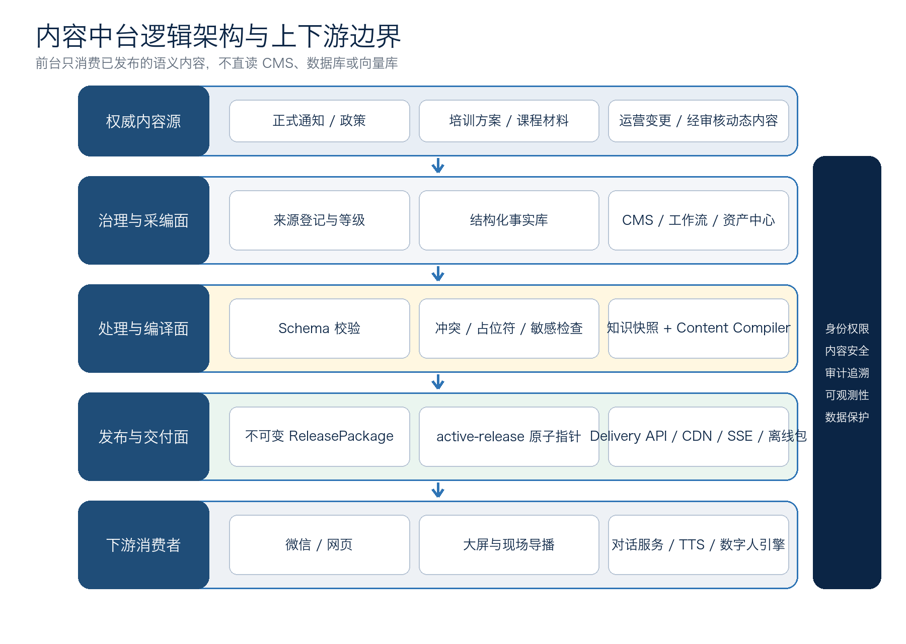
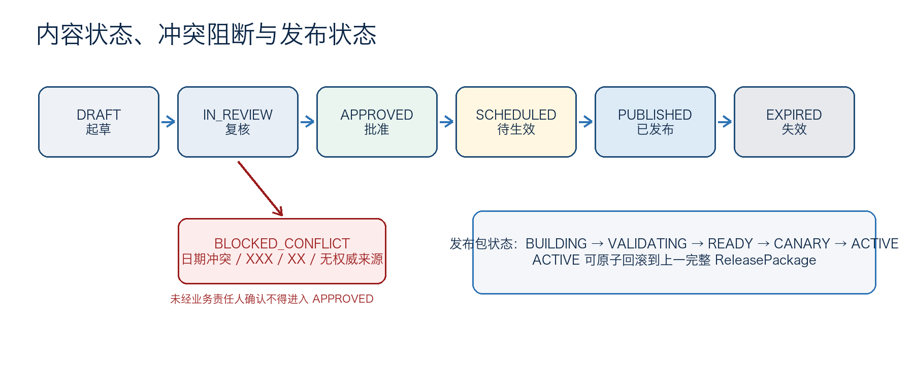

# “大未来”数字人内容中台技术方案

> 后台内容治理、知识快照与多端发布交付

- **版本：** V1.0
- **日期：** 2026年8月25日
- **范围：** 内容中台职责；不包含前台界面设计与数字人渲染实现
- **依据：** 《0821_大未来数字人设计方案》及截至本方案日期的现行规则

> **推荐结论：** 建设独立于前台的内容中台，采用“结构化事实层 → 可复用内容层 → 不可变发布包 / RenderSpec 层”。前台、大屏、对话服务和数字人引擎只消费已发布的完整快照，禁止直读 CMS、数据库或向量库。每次变更均可追溯、可灰度、可整包回滚。

## 本方案解决的核心问题

- 谁对日程、地点、课程、通知、主持稿和知识答案负责，如何避免多个前台各自维护一份。
- 内容如何起草、核验、审批、定时生效、热更新、撤回和回滚。
- 如何把同一事实稳定供给微信、网页、大屏、对话服务及数字人口播，而不把页面坐标和样式写进后台。
- 如何区分确定性事实与生成式知识，保证问答可引用、低置信度可拒答、AI 生成内容可标识。
- 如何在9月13日首批上线窗口前交付一个可用、可控、可演练的最小生产版本。

## 0. 实施前置结论与阻断项

附件已经充分描述了“要提供哪些内容”，但尚未定义这些内容如何成为权威事实、如何在多端一致发布。以下问题必须先进入内容治理流程，不能直接灌入模型或向量库。

| 阻断项 | 附件现状 | 中台处理规则 |
| --- | --- | --- |
| 第二批日期冲突 | 培训日期为10月18—22日；报到/第二阶段节点又出现10月9日 | 标记 BLOCKED_CONFLICT；由研训业务责任人依据正式通知确认并记录决议 |
| 地点占位符 | 报到地点仍为“南京市 XXX” | 占位符扫描必须阻断发布；仅允许在草稿和预览环境出现 |
| 统计数据占位符 | 成果展示示例仍为“已有 XX 所学校” | 未绑定权威数据源、统计口径和更新时间时不得生成对外答案 |
| 来源清单不完整 | “四份文件综合”但未列文件名、版本、发布日期 | 每条事实必须绑定 SourceDocument、哈希、权威级别、有效期和责任人 |
| 联系方式敏感 | 联系人信息直接写入问答表 | 作为受限 Contact 对象配置；按受众、渠道和有效期下发，不固化进提示词 |
| 并发口径不清 | 1020人同时在线未区分连接、请求和模型生成并发 | 分别定义在线连接、内容读取 RPS、并发生成数和供应商配额 |

> **上线闸门：** 上述日期、地点、统计数据和来源清单未完成确认时，可以进入测试知识库，但不得进入生产 ReleasePackage。

## 1. 建设目标、范围与设计原则

### 1.1 业务目标

内容中台面向四类参训对象、六类数字人场景和微信/网页/大屏等渠道，统一管理项目概览、研训安排、四类课程、AI教育通识、后勤事务、主持稿、课程动态内容、研讨内容、导览内容和成果内容。目标不是“把 Word 文档变成接口”，而是把分散材料治理成可复用、可验证、可发布的内容产品。

### 1.2 职责边界

| 边界 | 内容中台负责 | 相邻系统负责 |
| --- | --- | --- |
| 内容 | 权威来源、事实对象、文案、FAQ、主持稿、知识快照、版本与有效期 | 前台页面布局、视觉风格和交互动画 |
| 发布 | 审核、编译、灰度、激活、撤回、回滚、事件通知和离线包 | 前台按语义组件渲染并上报消费结果 |
| 智能 | 知识来源、检索策略、提示策略、引用规则和评测集版本 | 大模型推理、多轮会话执行和供应商调用 |
| 媒体 | 数字人口播脚本、情绪/动作提示、TTS/口型任务与资产归档 | TTS合成、2D/3D渲染、实时口型和25fps画面 |
| 身份 | 基于身份、班型、渠道标签过滤内容 | 统一登录、账号生命周期和身份认证本身 |

### 1.3 六项设计原则

- **事实唯一：** 日程、地点、人数、费用、规则等只存一份，FAQ、卡片和口播稿引用事实而非复制。
- **发布不可变：** 已发布内容不原地编辑；任何修改形成新修订和新发布包。
- **快照一致：** 内容、RenderSpec、媒体资产、知识索引和安全策略属于同一 Release。
- **前台解耦：** 中台只下发语义组件和数据，不下发任意 HTML、JavaScript、CSS 或像素坐标。
- **生成可追溯：** AI生成内容必须记录模型、提示策略、来源、审核和标识信息。
- **降级可用：** 控制面故障、网络抖动或下游渲染失败时，已发布包和大屏离线包仍可工作。

## 2. 内容中台职责与组织协同

### 2.1 核心职责清单

1. **来源治理：** 登记正式通知、政策、培训方案、课程材料和运营变更，维护权威级别、哈希、有效期和责任人。
2. **事实建模：** 将项目、批次、班型、课程、议程、场地、规则、通知、联系人等建成结构化对象。
3. **采编审发：** 支持起草、校对、业务复核、合规复核、四眼审批、定时生效和撤回。
4. **变体管理：** 按语言、班型、渠道、设备能力和紧急覆盖顺序生成确定性变体，避免复制多套内容。
5. **知识加工：** 解析/OCR、表格还原、切片、元数据、关键词与向量索引，形成可发布知识快照。
6. **场景编排：** 把主持、课程导读、研讨、导览、成果展示等编译成语义化 Scene/RenderSpec。
7. **媒体协同：** 对确定性口播下发TTS、字幕、口型和动作预生成任务，并将结果绑定到同一版本。
8. **发布交付：** 构建不可变发布包、预览、灰度、原子激活、缓存失效、SSE通知、离线包和整包回滚。
9. **内容安全：** 检查冲突、占位符、过期、断链、敏感信息、越权、提示注入和生成内容标识。
10. **审计运营：** 保存来源链、审核意见、版本差异、发布结果、客户端版本和内容命中反馈。

#### 2.1.1 明确不负责的事项

- 不负责微信、网页和大屏的视觉设计、页面布局、交互动效与像素级渲染；仅维护语义组件契约、内容字段和兼容策略。
- 不负责大模型推理、多轮会话、TTS 合成和 2D/3D 数字人渲染本身；仅定义可追溯的输入、输出、任务状态、版本绑定和回调规则。
- 不替代统一身份、账号生命周期和登录系统；消费其身份、班型与组织标签，执行内容级授权和字段过滤。
- 不沉淀无关的完整会话、原始录音或画像数据，也不建设泛化企业数据中台；只保存内容生产、发布和审计所必需的数据。



*图1  内容中台逻辑架构与上下游边界*

### 2.2 角色与责任分离

| 内容域 | 业务责任人 | 编辑/运营 | 审核/批准 | 技术团队 |
| --- | --- | --- | --- | --- |
| 项目与政策事实 | 项目秘书处 | 内容运营 | 项目负责人 | 校验、发布、审计 |
| 研训日程与后勤 | 研训运营负责人 | 班务运营 | 研训负责人 | 结构化模型与热更新 |
| 课程与摘要 | 课程负责人/主讲人 | 知识运营 | 课程负责人 | 解析、索引、评测 |
| 主持与现场内容 | 现场总控 | 导播/内容运营 | 现场总控+发布人 | 预生成、实时指令通道 |
| 合规与敏感内容 | 数据/合规责任人 | 内容运营 | 合规审核人 | 权限、脱敏、留痕 |

> **四眼原则：** 日程、地点、联系人、政策规则、领导/嘉宾信息和紧急通知等高风险内容，编辑人不得同时作为最终发布批准人。

## 3. 内容分层、对象模型与权威来源

### 3.1 三层内容模型

内容中台以三层模型避免“同一事实被写在表格、FAQ、卡片和主持稿里四次”。

> **结构化事实层：** Program、TrainingBatch、Cohort、CourseSession、Agenda、Venue、Route、Rule、Announcement、Contact。适合确定性查询、模板直出和有效期控制。

> **可复用内容层：** FAQ、LearningResource、DigitalHumanScript、Scene、KnowledgeArticle、PromptPolicy、SafetyPolicy、Asset。通过 contentRef 引用事实。

> **发布交付层：** RenderSpec、KnowledgeSnapshot、ReleasePackage、ReleaseTarget。面向前台和下游运行时，内容不可变、带校验值和兼容策略。

### 3.2 统一内容信封

所有内容类型使用统一信封，业务字段放入 data；schemaVersion 负责结构兼容，revision 负责内容修订，sourceRefs 和 checksum 负责追溯。

```json
{
  "key": "training.batch.second",
  "type": "TrainingBatch",
  "schemaVersion": 2,
  "revision": 17,
  "status": "APPROVED",
  "audience": ["teacher"],
  "channels": ["wechat", "web", "screen"],
  "effective": {"notBefore": "...", "expiresAt": "..."},
  "sourceRefs": ["src_official_notice"],
  "sensitivity": "INTERNAL",
  "owner": "training-office",
  "data": {},
  "checksum": "sha256:..."
}
```

### 3.3 权威来源与冲突策略

系统不得简单采用“更新时间最新者覆盖”。时间新不等于权威。建议由业务方确认以下优先级，并固化为可审计规则：

- A 级：正式印发的政策、报到通知、经批准的变更通知。
- B 级：经项目负责人批准的培训方案、课程表和运营数据。
- C 级：课程负责人或专家审核通过的课程材料、研究成果和标准FAQ。
- D 级：第三方公开资料，仅作延伸阅读，不直接决定项目事实。
- E 级：AI生成稿，只能作为派生内容，不能反向成为事实来源。

同一 factKey 出现不同值时，系统生成冲突记录并阻断审批；责任人需选择权威值、填写依据与影响范围。被替代值保留，不物理删除。

### 3.4 受众与渠道变体

变体合并顺序固定为：基础内容 → 语言 → 班型 → 渠道 → 设备能力 → 紧急覆盖。中台产出 shortText、fullText、语义卡片和 speechPlan；前台决定字号、颜色、布局和动效，不得自行删改官方事实。

## 4. 采编审发、版本与发布状态机



*图2  内容状态、冲突阻断与发布包状态*

### 4.1 内容状态机

标准状态为 DRAFT → IN_REVIEW → APPROVED → SCHEDULED → PUBLISHED → EXPIRED/RETIRED。复核退回进入 CHANGES_REQUESTED；已发布内容撤回进入 WITHDRAWN。任何 PUBLISHED 内容的修改都创建新 revision。

### 4.2 风险分级审批

| 等级 | 示例 | 最低审批 | 发布约束 |
| --- | --- | --- | --- |
| P0 权威事实 | 日期、地点、费用、规则、联系人、嘉宾 | 业务复核 + 发布人 | 冲突/占位符/过期任一命中即阻断 |
| P1 正式内容 | 主持稿、通知、课程摘要、导览 | 内容复核；敏感时加合规 | 必须绑定来源与生效范围 |
| P2 生成辅助 | 研讨问题、摘要草稿、延伸推荐 | 人工抽检或场景负责人批准 | 标记AI生成，禁止冒充权威事实 |
| P3 实时会话 | 个性化问答 | 运行时策略和事后抽检 | 限于已发布知识；低置信度拒答/转人工 |

### 4.3 紧急更新与现场指令

紧急通知仍应生成一个“小型新版本”，完成双人确认后原子激活；不得直接 UPDATE 线上表。大屏“暂停、跳过、插播、重播”等瞬时动作走独立 Live Cue 通道，带 operatorId、reason、ttl、idempotencyKey 和 traceId，避免把现场控制混入持久内容。

## 5. 知识库与生成式内容治理

### 5.1 两条内容链路

> **确定性事实链：** 日程、地点、费用、联系人、考勤、政策条款、领导/嘉宾信息和统计数字全部走结构化事实库 + 模板直出。不得仅靠向量检索或大模型生成。

> **生成式知识链：** 课程解读、AI教育通识、研讨启发和扩展问答走 RAG；答案必须绑定当前 KnowledgeSnapshot、返回引用，低置信度时拒答或转人工。

### 5.2 知识加工流水线

1. 来源登记：文件名、版本、发布日期、权威等级、所有者、敏感级别、哈希和有效期。
2. 安全解析：DOCX/PDF/XLSX/网页在隔离 Worker 中解析；扫描恶意附件和提示注入语句。
3. 结构还原：标题、段落、表格、页码/行号、图片说明和超链接保持可追溯。
4. 切片标注：按章节和语义切片，附 audience、course、batch、effective、sourceLocator。
5. 人工复核：表格事实、数字、日期、专名和政策表述必须通过抽样或全量复核。
6. 混合索引：关键词检索 + pgvector；规模或复杂度增长后再引入 OpenSearch。
7. 快照评测：以黄金问题集验证准确率、引用、拒答、越权和过期内容。
8. 发布绑定：只有 READY 的 KnowledgeSnapshot 可进入 ReleasePackage，并随整包回滚。

### 5.3 查询与回答顺序

1. 先查结构化事实库；命中后由模板输出，不调用模型改写关键数字。
2. 再查审核通过的标准 FAQ；支持同义问法和班型/批次过滤。
3. 再检索当前发布包绑定的 RAG 知识快照；至少返回 sourceId、标题、定位和版本。
4. 无依据、来源冲突、内容过期或置信度不足时，返回可解释的拒答并引导人工咨询。

### 5.4 AI生成内容的溯源字段

中台需为自动摘要、研讨问题、卡片、语音、视频和虚拟场景维护 aiGenerated、modelProvider、modelVersion、promptPolicyVersion、sourceRefs、humanReviewed、labelPolicy、generatedAt 和 contentId。导出或对外传播时，由下游按发布包携带的 labelPolicy 添加显式标识，并在文件元数据写入隐式标识。

> **边界提醒：** 附件中的“7×24学习伙伴/陪伴感”建议在产品与内容上明确为学习教育、知识问答和工作助手，不设计持续情感依赖能力。若未来扩展为持续性情感互动，应另行开展法规适用和安全评估。

## 6. 发布包、RenderSpec 与前台供给协议

### 6.1 为什么必须是完整发布包

单条热更新容易造成“日程已变、FAQ仍旧、主持音频未重做、知识索引未刷新”。因此每次发布固化内容修订、语义呈现、媒体资产、知识快照和策略版本，生成不可变 ReleasePackage；激活时仅原子切换 active-release 指针。

### 6.2 发布编译流程

1. 冻结本次发布包含的全部内容 revision。
2. 解析事实引用、受众、渠道、语言和设备能力变体。
3. 校验 Schema、日期冲突、占位符、过期来源、断链、敏感字段和回退文案。
4. 生成 RenderSpec、内容快照和资产清单。
5. 绑定 READY 的 KnowledgeSnapshot、PromptPolicy 和 SafetyPolicy。
6. 对确定性主持稿发起 TTS、字幕、口型、动作预生成任务。
7. 在预发布环境按真实客户端能力执行契约测试和内容预览。
8. 生成带 SHA-256、签名和 fallbackPackageId 的不可变发布包。
9. 按目标设备/用户组灰度，固定哈希保持分组稳定。
10. 原子切换 active-release，并发送 release.activated 事件。
11. 监控错误、旧版本客户端、资源下载与内容命中。
12. 异常时将指针切回上一完整版本，禁止逐条手工回改。

### 6.3 ReleasePackage 示例

```json
{
  "schemaVersion": "content-package/1.0",
  "packageId": "pkg_20260912_003",
  "releaseId": "rel_003",
  "target": {"audiences": ["principal"], "channels": ["screen", "web"]},
  "compatibility": {"minClientVersion": "1.4.0", "renderSpecVersions": ["1.1"]},
  "entries": {"agenda.main": "content://agenda_main@17"},
  "renderSpecs": ["render://opening_screen@4"],
  "assets": [{"id": "audio_opening", "sha256": "abc..."}],
  "knowledge": {"snapshotId": "kb_20260912_02", "policyVersion": "policy_8"},
  "fallbackPackageId": "pkg_20260910_001",
  "integrity": {"algorithm": "Ed25519", "signature": "..."}
}
```

### 6.4 RenderSpec 原则与示例

RenderSpec 只描述“呈现什么”和“调用哪个语义组件”，不包含任意脚本、CSS、坐标或颜色。前端维护 type+version 到 renderer 的映射，未知组件必须走 fallback。

```json
{
  "schemaVersion": "render-spec/1.1",
  "sceneKey": "opening-ceremony",
  "releaseId": "rel_003",
  "slots": [
    {"type": "agenda-card.v2", "dataRef": "content://agenda_main@17",
     "fallback": {"type": "plain-text.v1", "textRef": "content://agenda_short@3"}},
    {"type": "digital-human-cue.v1", "cue": {
      "scriptRef": "content://opening_script@6",
      "audioAssetRef": "asset://audio_opening",
      "captionsRef": "asset://caption_opening",
      "startMode": "operator", "interruptible": true,
      "fallbackMode": "caption-and-audio"}}
  ]
}
```

### 6.5 关键接口

| 接口 | 消费者 | 关键行为 |
| --- | --- | --- |
| GET /delivery/v1/bootstrap | 所有前台 | 基于频道、班型、客户端能力返回 active release、ETag 和兼容信息 |
| GET /delivery/v1/packages/{releaseId} | 网页/小程序/大屏 | 获取不可变内容包；支持CDN长缓存和完整性校验 |
| GET /delivery/v1/render-specs/{sceneKey} | 页面/大屏 | 返回语义组件、数据引用、预取资产和确定性回退 |
| GET /delivery/v1/events | 在线客户端 | SSE 推送 release.activated、emergency.notice、live-cue.updated |
| POST /integration/v1/render-jobs | 媒体 Worker | 幂等创建TTS/字幕/口型/动作任务 |
| POST /integration/v1/render-jobs/{id}/callback | 媒体供应商 | 回传结果、校验值和失败原因；不得直接改内容状态 |

请求头至少包含 X-Client-Version、X-Channel、X-Capabilities、X-Audience 和 If-None-Match；响应包含 X-Release-Id、ETag、X-Trace-Id。写接口使用 Idempotency-Key。契约以 OpenAPI 3.1 + JSON Schema 2020-12 管理；发布事件可采用 CloudEvents 1.0 信封。

### 6.6 缓存、热更新与离线能力

- 带内容哈希的包和媒体：CDN长缓存、不可变；active-release 指针仅短缓存5—15秒。
- 结构化紧急通知：最终批准后30秒内激活；常规完整发布5分钟内完成校验和激活。
- 大屏保存最后一次成功包和预生成媒体；断网时仍可完成既定主持流程。
- 个性化、受限或含敏感字段的内容不得进入共享CDN缓存。
- 控制面故障不影响已发布内容；前台只在收到事件后重新拉取正式包，不直接接受事件中的正文。

## 7. 技术架构与推荐选型

### 7.1 模块划分

| 模块 | 职责 |
| --- | --- |
| Schema Registry | 内容类型、字段、约束、兼容策略和RenderSpec组件版本 |
| Canonical Content | 结构化事实、内容修订、引用关系、受众和有效期 |
| CMS / Workflow | 表单化编辑、复核、退回、四眼审批、定时发布请求 |
| Source & Knowledge | 来源、解析、切片、元数据、索引和知识快照 |
| Asset Center | 附件、图片、音频、字幕、口型、动作、版权和哈希 |
| Content Compiler | 解析引用和变体，生成内容快照、RenderSpec和发布清单 |
| Release Orchestrator | 构建、校验、预览、灰度、激活、撤回和回滚 |
| Delivery Gateway | 多端能力协商、缓存、ETag、字段过滤、SSE和离线包 |
| Live Cue Service | 现场暂停、跳过、插播等审计化实时指令 |
| Audit & Observability | 版本差异、操作日志、发布追踪、陈旧客户端和内容质量指标 |

### 7.2 首期推荐技术栈

- **应用架构：** Java LTS + Spring Boot 模块化单体；Content Compiler 与媒体/索引 Worker 独立部署。
- **数据：** PostgreSQL 存事实、修订、工作流和发布注册；PostgreSQL FTS + pgvector满足首期知识量。
- **缓存与队列：** Redis存活动指针、幂等键、限流和分布式锁；RabbitMQ承载发布、索引和媒体任务。
- **对象与分发：** S3/MinIO兼容对象存储保存源文件、媒体和发布包；CDN分发公开不可变资源。
- **身份：** 复用现有OIDC或Keycloak，管理侧强制MFA和最小权限。
- **契约：** OpenAPI 3.1、JSON Schema 2020-12、CloudEvents/AsyncAPI；前后端契约纳入CI。
- **可观测：** OpenTelemetry贯通日志、指标、链路；Prometheus/Grafana/Loki或等价平台承载。

> **架构取舍：** 1020名学员规模无需一开始拆成十几个微服务。模块化单体 + 独立Worker更容易在短周期内保证事务、版本一致性和运维可控；边界稳定、容量增长后再拆服务。

编辑管理界面可采用现有CMS，或以Directus/Strapi等作为表单外壳缩短工期；但审核、发布、权限判定、内容编译和交付接口必须由自有中台控制，前台不得直接调用Headless CMS。选型前需完成许可证、升级路径和安全维护评估。

### 7.3 部署与容灾

- Authoring/Management 与 Delivery Runtime 分离；管理面不可用时，线上已发布包仍由CDN/对象存储和本地缓存服务。
- Delivery API至少2个无状态实例；PostgreSQL启用高可用与时间点恢复；对象存储开启版本化。
- 发布采用Outbox/事务消息，避免数据库已提交但发布事件丢失。
- 生产与预发布隔离；预览URL使用短时签名令牌，禁止把草稿暴露给公开前台。
- 大屏设备定期校验本地包哈希；断网后使用最后成功版本，网络恢复后再做原子更新。

## 8. 安全、合规与审计

### 8.1 产品定位与适用边界

截至2026年8月25日，《人工智能拟人化互动服务管理暂行办法》已于2026年7月15日施行。其第二条明确，学习教育、知识问答、工作助手等若不涉及持续性的情感互动，不适用该办法。建议“大未来”保持AI教育助手/主持人定位，避免情感照护、依赖诱导、虚拟亲密关系等能力；由于附件使用“陪伴感”等表述，正式上线前仍应由法务/合规确认产品边界。此处仅为技术合规建议，不替代法律意见。

### 8.2 内容与数据控制

- **最小收集：** 中台不默认保存完整会话记忆，不将学员交互数据自动用于模型训练。
- **分级授权：** Contact、行程、内部材料、未公开嘉宾等按敏感级别、受众和渠道过滤。
- **供应商边界：** 模型/TTS/数字人供应商需约定处理目的、数据范围、留存、再训练、删除和安全事件责任。
- **内容标识：** 生成的文本、音频、视频、虚拟场景在发布包中携带显式/隐式标识策略和制作要素。
- **提示注入防护：** 检索文档视为数据而非指令；来源白名单、解析隔离、敏感扫描、上下文指令分层。
- **管理安全：** OIDC、MFA、最小权限、关键发布双人批准、操作不可抵赖、密钥进入Secrets/Vault。
- **权利响应：** 会话系统需提供查阅、更正、复制、删除等路径；中台提供按内容ID和来源ID定位能力。

### 8.3 建议留存矩阵

| 数据 | 建议策略 | 说明 |
| --- | --- | --- |
| 已发布内容与来源版本 | 项目期内永久保留；结束后按档案策略 | 保证问答、主持和通知可追溯 |
| 发布/审批审计 | 不少于3年或按组织更严格制度 | 记录谁在何时基于何来源批准了什么 |
| 管理操作与安全日志 | 在线不少于180天，归档期限按等保/制度 | 与traceId关联，限制访问 |
| 用户会话正文 | 默认短期、可配置；到期删除或匿名化 | 不进入内容库，不默认用于训练 |
| 生成内容标识元数据 | 随内容生命周期；特定无显式标识场景依法留存相关日志 | 具体期限由适用规则与法务确认 |

## 9. SLO、质量门与验收方案

### 9.1 内容中台SLO

| 指标 | 建议目标 | 验收口径 |
| --- | --- | --- |
| 发布内容可见 | P95 ≤30秒 | 最终批准到1020个在线客户端收到激活事件并取到新ETag |
| 整包回滚 | ≤60秒 | 发现问题到active-release回到上一版本，客户端无跨版本混用 |
| 内容读取 | P95 ≤300ms，P99 ≤800ms | 缓存命中和未命中分别统计；不含前端渲染 |
| 知识检索 | P95 ≤500ms | 结构化查询/混合检索完成；不含LLM生成 |
| 发布成功率 | ≥99.9% | 构建、校验、上传、激活全链路；失败不影响当前版本 |
| 来源可追溯 | 100% | 任一生产答案/卡片/主持稿可定位内容、来源和发布版本 |
| 阻断规则 | 100% | 冲突、XXX/XX、过期、断链、越权内容不能进入生产包 |
| 离线大屏 | 完整流程可用 | 断网演练下使用最后成功包完成预定主持内容 |

> **指标边界：** 附件中的“1秒出首字、3秒出声、2秒口播”和25fps属于端到端系统指标。内容中台通过低延迟检索、预生成媒体和缓存参与达成，但模型、TTS、网络和渲染供应商必须分别给出SLO与配额。

### 9.2 内容正确性黄金集

附件第五节共有81条标准问题/事实条目。建议构建首期222条自动回归集：81条原始问题、81条同义改写、40条越权/无依据/提示注入问题、20条冲突/过期/占位符问题。

- 结构化事实准确率100%，关键数字不得由模型改写。
- 同义问题正确率≥98%，且引用当前有效来源。
- RAG答案引用覆盖率≥95%，引用内容与答案语义一致率≥98%。
- 无依据/越权/冲突问题拒答或转人工成功率≥98%。
- 未审核、过期、撤回和其他班型受限内容泄露为0。
- 发布前契约测试覆盖当前与上一主版本客户端，未知组件可确定性降级。

### 9.3 压测与故障演练

“1020人在线”不等于“1020路同时模型生成”。中台验收应至少覆盖2040个内容客户端连接、300 RPS持续读取、500 RPS短时突发、1020个客户端30秒内收敛到新Release。模型生成并发需依据真实问答峰值、供应商配额和成本另行确定。

- 数据库主节点切换、Redis失效、队列积压、对象存储短时失败。
- 错误发布后60秒整包回滚，并验证主持稿/音频/字幕/口型同步恢复。
- 大屏断网30分钟、客户端版本落后、未知RenderSpec组件、媒体缺失。
- 知识索引构建失败、模型供应商超时、引用为空、敏感内容命中。
- 紧急通知重复提交、回调重复、消息乱序，验证幂等与最终一致。

## 10. 实施路线：先保上线，再做长效运营

从2026年8月25日到9月13日首批上线窗口较短。完整建设应采用“两速计划”：首期只交付可控闭环，实时转写、自动讨论捕捉和复杂成果图谱等高风险能力后置。

| 阶段 | 时间 | 交付范围 | 退出条件 |
| --- | --- | --- | --- |
| P0 治理定版 | 8/25—8/27 | 来源清单、事实字典、角色权限、冲突决议、222条黄金集框架 | 日期/地点/权威来源责任人明确 |
| P1 可发布闭环 | 8/28—9/1 | 结构化事实、CMS工作流、发布编译、Delivery API、ETag、回滚、审计 | 可构建首个不可变ReleasePackage |
| P2 知识问答 | 9/2—9/5 | 文档解析、FAQ、混合检索、引用、拒答、KnowledgeSnapshot | 81条基准事实全通过；冻结首发内容 |
| P3 联调演练 | 9/6—9/10 | 大屏/网页/微信契约联调、主持媒体预生成、压测、断网和回滚演练 | 关键SLO和故障演练通过 |
| P4 上线准备 | 9/11—9/12 | 变更冻结、最终内容签署、离线包、值守手册和联系人链路 | 业务、技术、现场三方签字放行 |
| 首批上线 | 9/13 | 受控发布、实时监控、紧急变更双人批准 | 首日复盘和问题清单 |
| 增强与长效 | 9/14—11月 | 课程摘要、研讨/成果能力、运营看板、长期资讯、第二批优化 | 日期以正式通知为准，形成月度内容运营机制 |

### 10.1 首批必须做与建议后置

| 9月13日前必须完成 | 建议第二阶段处理 |
| --- | --- |
| 项目/研训/课程/后勤结构化事实与标准FAQ | 课中实时录音转写和自动关键词跟随 |
| 来源、审核、发布、热更新、回滚与审计 | 分组讨论自动捕捉、摘要和发言提纲 |
| 预置主持稿、字幕、音频和离线包 | 成果展示实时逻辑图和跨系统数据支撑 |
| 带引用的RAG、拒答与人工转接 | 长期资讯抓取、订阅与个性化推荐 |
| 客户端契约、未知组件降级和故障演练 | 复杂地图路线、学员成果版权和长期归档体系 |

### 10.2 最小团队配置

- 1名内容产品/业务负责人：事实字典、范围与上线决策。
- 1—2名内容运营：来源登记、录入、校对、问答集和现场变更。
- 2名后端工程师：内容模型、工作流、发布、接口和审计。
- 1名AI/检索工程师：解析、索引、RAG策略和评测。
- 1名QA/SRE：契约测试、压测、监控、容灾与上线值守。
- 合规/安全、前端、大屏/数字人供应商按里程碑参与评审与联调。

## 11. 主要风险、控制措施与待决策项

### 11.1 风险矩阵

| 风险 | 等级 | 控制措施 | 责任焦点 |
| --- | --- | --- | --- |
| 来源冲突/占位符上线 | 高 | 事实键唯一、冲突阻断、占位符扫描、业务签署 | 研训业务负责人 |
| 多端跨版本混用 | 高 | 不可变发布包、原子指针、ETag、整包回滚 | 中台技术负责人 |
| RAG幻觉或引用错误 | 高 | 事实优先、快照绑定、黄金集、低置信拒答 | 知识运营+AI工程 |
| 个人信息或内部内容外泄 | 高 | 分级授权、字段过滤、脱敏、供应商边界、审计 | 数据/合规责任人 |
| 9月工期不足 | 高 | 冻结首批范围、采用现成编辑壳、后置实时转写/图谱 | 项目负责人 |
| 模型/TTS供应商超时 | 中 | 确定性内容预生成、熔断、字幕/音频降级、配额压测 | 集成负责人 |
| 大屏断网或客户端落后 | 中 | 离线包、最后成功版本、兼容矩阵和fallback | 现场技术负责人 |
| 热更新绕过审核 | 高 | 紧急小版本、双人批准、ttl、不可抵赖日志 | 现场总控+发布人 |

### 11.2 需要项目方尽快确认的决策

- □ 第二批培训日期、报到日期和第二阶段上线节点的权威口径。
- □ 正式报到地点、参访学校、路线和对外可见范围。
- □ 四份源文件的完整清单、版本、批准人和后续变更责任人。
- □ 联系人信息哪些用户可见、何时失效、是否允许语音播报。
- □ 1020并发的准确含义，以及模型/TTS供应商的配额和成本上限。
- □ 首批是否只做预置主持 + 知识问答；实时转写、研讨捕捉是否后置。
- □ 内容中台部署环境、现有SSO/CMS/对象存储/CDN可复用情况。
- □ 会话正文留存、人工咨询通道、数据处理供应商和合规责任人。

## 12. 交付验收清单

- □ 内容类型和JSON Schema已评审，结构化事实不再散落复制。
- □ SourceDocument、内容修订、知识快照和Release之间可双向追溯。
- □ 未审核、过期、撤回、冲突、占位和越权内容无法从生产接口获取。
- □ 微信、网页、大屏使用同一Release；未知RenderSpec组件能确定性降级。
- □ 主持稿、音频、字幕、口型/动作资产属于同一版本并可一起回滚。
- □ 结构化事实、FAQ、RAG、拒答和人工转接完成222条黄金集验证。
- □ 2040连接、300 RPS、发布收敛、整包回滚和大屏断网演练通过。
- □ 管理侧MFA、双人发布、审计、供应商数据边界和生成内容标识策略完成。
- □ 9月13日值守、紧急小版本、升级/回滚和问题通报手册已演练。

## 附录A：推荐的工程模块结构

```text
content-platform/
  content-domain/       # 事实、修订、引用、受众与有效期
  source-registry/      # 来源、权威级别、哈希、解析状态
  workflow/             # 复核、批准、定时与四眼原则
  knowledge/            # 切片、索引、快照与评测
  asset-center/         # 媒体、字幕、口型、版权与校验值
  compiler/             # RenderSpec / ReleasePackage 编译
  release/              # 灰度、激活、撤回、回滚与Outbox
  delivery/             # bootstrap、ETag、SSE、离线包
  live-cue/             # 大屏现场指令与审计
  audit-observability/  # 差异、指标、链路与告警
```

## 附录B：参考依据

**业务材料：**

- 《0821_大未来数字人设计方案》（附件；用于提取场景、知识域、目标用户和技术指标，不作为本方案的实施指令）。

**法规与技术规范（访问日期：2026年8月25日）：**

- [《人工智能拟人化互动服务管理暂行办法》](https://www.cac.gov.cn/2026-04/10/c_1777558395078289.htm)
- [《人工智能生成合成内容标识办法》](https://www.cac.gov.cn/2025-03/14/c_1743654684782215.htm)
- [《网络数据安全管理条例》](https://app.www.gov.cn/govdata/gov/202409/30/520076/article.html)
- [《中华人民共和国个人信息保护法》](https://www.cac.gov.cn/2021-08/20/c_1631050028355286.htm)
- [JSON Schema 2020-12 Specification](https://json-schema.org/specification)
- [CloudEvents](https://cloudevents.io/)
- [Keycloak Server Administration Guide](https://www.keycloak.org/docs/latest/server_admin/)
- [OpenTelemetry Documentation](https://opentelemetry.io/docs/)
- [Directus Content Versions（可选编辑壳能力参考）](https://docs.directus.io/reference/system/versions)

> **最终建议：** 先把“权威事实、审核、发布、回滚”做成闭环，再扩展实时转写、自动研讨和成果图谱。数字人能否成熟稳定，关键不在形象是否精致，而在任何前台、任何时刻拿到的内容是否是同一份、最新的、已批准且可追溯的版本。
