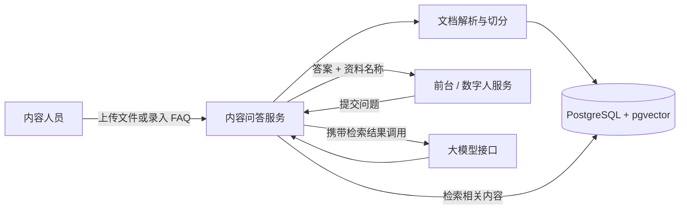

# “大未来”数字人内容问答 MVP 极简方案

- **版本：** V1.1
- **日期：** 2026年9月3日
- **目标：** 后台放入内容，前台提交问题，系统根据已放入的内容返回答案
- **范围：** 只做内容录入、内容检索和问答接口；不做前台界面

## 1. 一句话方案

> 把 Word、PDF、Markdown、TXT 或整理好的 FAQ 上传到后台，系统自动解析和建立索引；前台调用一个问答接口，后台从资料中找到相关内容，再让大模型依据找到的内容组织回答。

首版流程简化为：

```text
内容上传 → 自动解析与索引 → 前台提问 → 检索相关内容 → 返回答案和资料名称
```

不设置复核、审批、发布包、灰度发布和整包回滚。

## 2. MVP 做什么

### 2.1 必须完成

1. 支持上传 `DOCX`、文本型 `PDF`、`Markdown` 和 `TXT`。
2. 支持直接录入“问题 + 标准答案”的 FAQ。
3. 上传后自动提取文字、切分内容并建立向量索引。
4. 前台通过一个 HTTP 接口提交问题。
5. 系统只根据当前启用的内容回答。
6. 回答中返回资料名称，方便确认答案来自哪里。
7. 找不到可靠内容时回答“当前资料中暂无相关信息”，不自行编造。
8. 内容更新后自动重新索引；新索引成功前继续使用旧内容。

### 2.2 首版不做

- 内容复核和审批流程。
- 多角色权限体系；只保留一个后台管理密钥。
- ReleasePackage、灰度发布、版本回滚和多端发布编排。
- SSE、WebSocket 和流式回答。
- TTS、口型、动作及数字人渲染。
- 录音转写、研讨捕捉和成果图谱。
- 用户画像、个性化推荐和复杂统计。
- 扫描版 PDF 的 OCR；首版由内容人员先转换为可复制文字。

## 3. 最小架构



只需要两个本地容器和一个已有或外部模型接口：

| 组件 | 作用 |
| --- | --- |
| `content-api` | 文件上传、解析、索引、检索和问答接口 |
| `postgres` | 保存文档、FAQ、文本片段和向量 |
| 大模型/Embedding API | 生成文本向量，并根据检索内容组织答案 |

推荐使用 Docker Compose 启动。若需要从公网访问，再在现有网关或 Nginx 上配置 HTTPS；本地演示不额外增加网关组件。

## 4. 最小数据结构

首版只需要两类主要数据。

### 4.1 文档

```text
document_id
title
file_name
file_type
content_hash
status            # PROCESSING / READY / FAILED / DISABLED
created_at
updated_at
```

### 4.2 内容片段

```text
chunk_id
document_id
chunk_text
chunk_order
embedding
metadata
```

FAQ 也按文档处理，每条 FAQ 形成一个独立内容片段，内容包括标准问题、相近问法和标准答案。

上传同一份资料的新版本时，先在后台生成新索引；只有全部处理成功后才把新版本设为 `READY`。这样不会在索引到一半时给前台返回残缺答案。这只是技术状态切换，不包含人工复核。

## 5. 最小接口

### 5.1 上传资料

```http
POST /api/v1/documents
Authorization: Bearer <ADMIN_API_KEY>
Content-Type: multipart/form-data
```

返回：

```json
{
  "documentId": "doc_001",
  "title": "大未来培训安排",
  "status": "PROCESSING"
}
```

### 5.2 查看处理状态

```http
GET /api/v1/documents/{documentId}
Authorization: Bearer <ADMIN_API_KEY>
```

返回：

```json
{
  "documentId": "doc_001",
  "title": "大未来培训安排",
  "status": "READY",
  "chunkCount": 36,
  "updatedAt": "2026-09-03T16:00:00+08:00"
}
```

### 5.3 录入 FAQ

```http
POST /api/v1/faqs
Authorization: Bearer <ADMIN_API_KEY>
Content-Type: application/json
```

```json
{
  "question": "培训在哪里报到？",
  "similarQuestions": ["报到地点在哪里？", "去哪里报到？"],
  "answer": "以当前录入的正式培训通知为准。",
  "sourceTitle": "大未来培训安排"
}
```

### 5.4 前台问答

```http
POST /api/v1/answer
Content-Type: application/json
```

请求：

```json
{
  "question": "培训在哪里报到？"
}
```

有答案时：

```json
{
  "answered": true,
  "answer": "根据当前培训安排，报到地点为……",
  "speechText": "根据当前培训安排，报到地点为……",
  "references": [
    {
      "documentId": "doc_001",
      "title": "大未来培训安排"
    }
  ]
}
```

没有可靠答案时：

```json
{
  "answered": false,
  "answer": "当前资料中暂无相关信息，请联系项目工作人员确认。",
  "speechText": "当前资料中暂无相关信息，请联系项目工作人员确认。",
  "references": []
}
```

前台只需要接入 `/api/v1/answer`，把 `answer` 显示出来，或把 `speechText` 交给数字人播报。

## 6. 回答逻辑

每次提问只执行以下步骤：

1. 对问题生成向量。
2. 从 `READY` 状态的内容片段中查找最相关的 3—5 段。
3. 相关度低于阈值时直接返回“暂无相关信息”。
4. 相关度满足要求时，把检索内容和问题一起交给大模型。
5. 大模型只能依据提供的内容回答，并返回引用的资料名称。

建议使用下面的固定提示规则：

```text
你是“大未来”项目的内容问答助手。
只能依据“参考资料”回答，不得补充参考资料中没有的信息。
资料不足、内容冲突或无法确认时，回答“当前资料中暂无可确认的信息”。
涉及日期、地点、费用、人员和规则时，不得猜测或改写数字。
回答简洁，适合直接显示或由数字人播报。
```

Embedding 相似度在不同模型中的含义不同，不预先写死一个通用数值。上线前使用实际问题做小规模测试，再确定拒答阈值。

## 7. 内容更新方式

首版不做审批，内容人员对上传资料的准确性直接负责。

- 新增资料：上传后自动解析和索引。
- 修改资料：上传新版本，索引完成后自动替换旧版本。
- 停用资料：将文档状态改为 `DISABLED`，后续回答不再检索它。
- 索引失败：状态显示为 `FAILED`，原有可用版本不受影响。
- 内容冲突：首版不自动判断哪份资料更权威；冲突资料应先由内容人员清理，或分别停用错误版本。

原始方案中仍含“南京市 XXX”、`XX` 统计值以及日期口径冲突。这些内容应在导入前删除、改为“待确认”，或者暂不上传，否则系统会忠实地依据错误内容回答。

## 8. 最小安全要求

虽然不做复杂权限，仍保留以下底线：

- 上传、修改、停用和重建索引接口必须使用 `ADMIN_API_KEY`。
- 前台只能调用问答接口，不能访问数据库和后台管理接口。
- API Key、模型密钥和数据库密码只放在服务器环境变量中，不写入代码仓库。
- 限制文件类型和大小，不执行文档中的宏、脚本或外部链接。
- 日志默认不记录完整问题正文和模型密钥。
- 对外服务使用 HTTPS，并对问答接口设置基本限流。

## 9. 三天实施计划

前提：已经有可调用的大模型和 Embedding 接口，并能提供一台安装 Docker 的 Linux 主机。

| 时间 | 工作 | 完成标志 |
| --- | --- | --- |
| 第1天 | 建立 Compose、数据库和内容 API；完成 DOCX/Markdown/TXT 解析 | 能上传资料并看到 `READY` 状态 |
| 第2天 | 完成切分、Embedding、向量检索和 `/answer` 接口 | 命中资料时能返回答案和资料名称 |
| 第3天 | 导入真实内容、调整拒答阈值、完成前台联调和部署说明 | 前台真实请求能正常回答或拒答 |

如果需要处理扫描版 PDF、接入新的模型供应商或从公网完成域名/证书配置，增加 1—2 天。

### 最小人员

- 1 名后端工程师：约 3—4 人日。
- 1 名内容人员：约 1—2 人日，负责整理和导入资料。
- 1 名前端联调人员：约 0.5 人日，只负责调用接口。

## 10. MVP 验收

准备 20—30 个真实问题，其中包括能回答和不能回答的情况，现场验证：

1. 上传一份新资料后，可以自动完成索引。
2. 对资料中明确写明的问题，可以返回正确答案和资料名称。
3. 对资料中没有的问题，返回“暂无相关信息”，不编造。
4. 将一份资料设为 `DISABLED` 后，后续回答不再引用它。
5. 上传新版本索引失败时，旧版本仍能正常回答。
6. 修改后台草稿文件不会直接影响回答，只有索引完成的 `READY` 内容才生效。
7. 前台能够把 `answer` 显示出来，并把 `speechText` 交给数字人播报。

以上七项通过，就可以认为内容问答 MVP 已经跑起来。

## 11. 启动前只需确认四件事

1. 准备用哪一台 Linux 主机运行 Docker Compose。
2. 大模型和 Embedding 接口地址、模型名及调用密钥。
3. 第一批准备导入哪些 DOCX、PDF、Markdown 或 FAQ。
4. 前台调用 `/api/v1/answer` 时是否需要一个固定的服务密钥。
